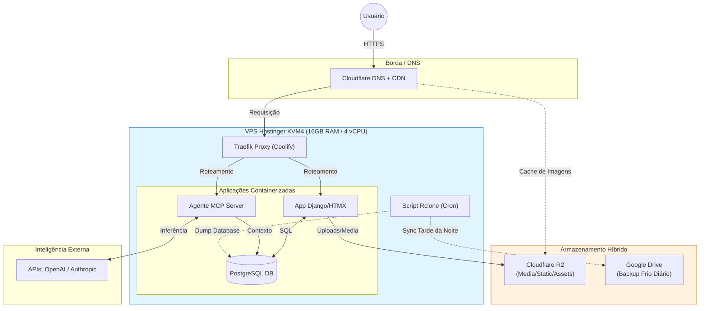

# CONTEXT.md

## 🎯 Objetivo do Arquivo
Este documento define as restrições de infraestrutura, arquitetura e custos para este projeto. **Qualquer IA analisando este código deve aderir estritamente a estas diretrizes** para evitar sugestões que gerem custos extras ou complexidade desnecessária.

---

## 🏗️ Arquitetura Visual (Infrastructure Map)

---

## ⚙️ Especificações de Hardware (Compute)
* **Provedor:** Hostinger (Plano VPS KVM 4).
* **Recursos:**
    * **CPU:** 4 vCPU.
    * **RAM:** 16 GB (Abundante, priorizar processos em memória vs disco).
    * **Disco:** 200 GB NVMe (Rápido, mas finito e não redundante).
    * **Rede:** 16 TB Bandwidth.
* **Gerenciamento:** **Coolify** (PaaS Self-hosted).
    * Deploy via Git Push.
    * SSL gerenciado automaticamente (Let's Encrypt).

## 💾 Estratégia de Armazenamento (Storage Policy)
**CRÍTICO:** O disco do VPS é efêmero para dados do usuário.

1.  **Arquivos Estáticos e Mídia (Django Media):**
    * **Destino:** **Cloudflare R2**.
    * **Protocolo:** AWS S3 Compatible (`boto3` + `django-storages`).
    * **Regra de Custo:** Manter no Free Tier (10GB). Usar cache do Cloudflare para evitar cobrança de operações de leitura (Class B).
    * **Configuração:** `AWS_QUERYSTRING_AUTH = False` para permitir cache público.

2.  **Banco de Dados (PostgreSQL):**
    * **Execução:** Container Docker no VPS (para baixa latência).
    * **Persistência:** Volume Docker local.

3.  **Backups e Disaster Recovery:**
    * **Ferramenta:** `Rclone` instalado no Host (VPS).
    * **Destino:** **Google Drive**.
    * **Frequência:** Diária (via Cron job).
    * **Conteúdo:** Dump do PostgreSQL (.sql.gz).

## 🛠️ Stack Tecnológica
* **Backend:** Python 3.x (Django ou FastAPI).
* **Frontend:** Server-side rendered (Django Templates) + HTMX.
    * *Nota:* SPAs (Vue/React) apenas se estritamente necessário; preferência por simplicidade.
* **Infra:** Docker & Docker Compose.
* **IA & Agentes:**
    * Agentes MCP rodam localmente no VPS.
    * Processamento pesado (Inferência) delegado via API (OpenAI/Claude).

## 🚫 Restrições (Do Not Suggest)
1.  **Não sugerir** bancos de dados gerenciados (AWS RDS, Google Cloud SQL) devido ao custo.
2.  **Não sugerir** Kubernetes (K8s) ou orquestração complexa.
3.  **Não sugerir** armazenamento S3 da AWS (custo de Egress/Saída de dados).
4.  **Não sugerir** salvar uploads de usuários no disco local do VPS (`/media/` local é proibido em produção).

## 💡 Instruções para Geração de Código
Ao criar scripts de deploy ou configurações do Django (`settings.py`):
* Sempre inclua a configuração do `django-storages` apontando para variáveis de ambiente do R2.
* Assuma que o banco de dados é acessível via rede interna Docker (`postgres` host), não `localhost`.
* Para tarefas agendadas (Celery/Cron), lembre-se que temos RAM de sobra (16GB), então workers em memória são bem-vindos.
