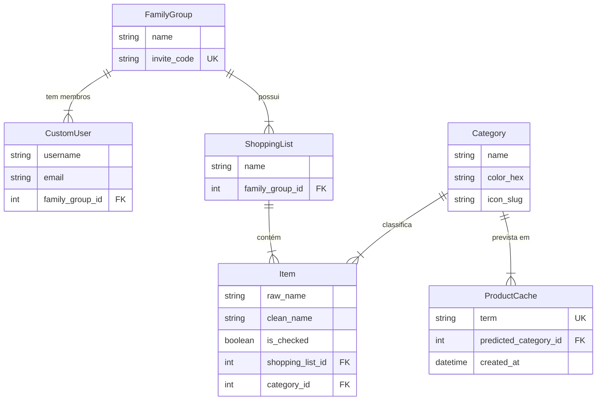

# Esquema do Banco de Dados

Este documento detalha a modelagem de dados do **TrazAí**. O banco de dados escolhido é o **PostgreSQL**.

## Diagrama Entidade-Relacionamento (Conceitual)

## Detalhamento das Entidades

### 1. Accounts (App: `accounts`)

#### **FamilyGroup**
Representa o núcleo familiar ou grupo de amigos que compartilham as listas.
-   `id`: UUID ou AutoInt.
-   `name`: Nome do grupo (ex: "Família Silva").
-   `invite_code`: Código único de 6 caracteres para convidar novos membros.
-   `created_at`: Data de criação.

#### **CustomUser**
Estende o usuário padrão do Django.
-   `family_group`: Foreign Key para `FamilyGroup` (Um usuário pertence a apenas um grupo no MVP).

### 2. Lists (App: `lists`)

#### **ShoppingList**
Uma lista de compras específica (ex: "Mercado Semanal", "Churrasco").
-   `name`: Título da lista.
-   `family_group`: Foreign Key para `FamilyGroup`.
-   `is_archived`: Boolean (para soft delete ou histórico).

#### **Category**
Categorias de produtos para organização (ex: "Laticínios", "Limpeza", "Hortifruti").
-   `name`: Nome da categoria.
-   `color_hex`: Cor para UI (ex: `#FF5733`).
-   `icon_slug`: Identificador de ícone (ex: `mdi-carrot`).

#### **Item**
O item individual na lista.
-   `raw_name`: O que o usuário digitou/falou (ex: "2 caixas de leite desnatado").
-   `clean_name`: Nome processado para IA (ex: "leite desnatado").
-   `shopping_list`: Foreign Key para `ShoppingList`.
-   `category`: Foreign Key para `Category` (Pode ser NULL inicialmente, preenchido pela IA).
-   `is_checked`: Boolean (marcado como comprado).
-   `created_by`: Foreign Key para `User` (opcional, para auditoria).

#### **ProductCache**
Tabela auxiliar para economizar chamadas de API e melhorar performance.
-   `term`: O termo pesquisado/adicionado (ex: "sabão em pó"). **Unique Index**.
-   `predicted_category`: Foreign Key para `Category`.
-   `confidence_score`: Float (opcional, confiança da IA).
-   `hit_count`: Integer (quantas vezes esse termo foi usado - útil para analytics).

## Notas de Implementação

-   **UUIDs vs Integers:** Para facilitar a exposição de IDs na API e evitar enumeração, considerar o uso de `UUIDField` como chave primária para `ShoppingList` e `Item`.
-   **Soft Delete:** Itens não devem ser deletados fisicamente imediatamente, mas marcados como arquivados ou deletados para permitir "Desfazer".
-   **Normalização:** O nome do item (`raw_name`) é mantido para preservar a intenção original do usuário, mas `clean_name` pode ser usado para melhor correspondência no cache.
